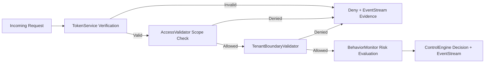

# PHP-Cloud-Sentry

Deterministic, multi-tenant security controls for PHP workloads.

## Current Direction

PHP-Cloud-Sentry is currently focused on being a **practical reference implementation** of core control paths:

1. **Deterministic token verification** (HMAC signing + TTL + region validation)
2. **Explicit authorization and tenant boundary enforcement**
3. **Lightweight behavior/risk scoring (UEBA-style signals)**
4. **Append-only JSON event evidence for auditability**

Instead of framework-theory-only documentation, the project now prioritizes runnable PHP code that teams can execute, adapt, and extend.

## Design Intent (Preserved)

While the implementation is intentionally lightweight, it still aligns with the original control intent that drove earlier versions of this repository:

- **Deterministic authentication controls** (ISO 27001 / SOC 2 CC6 style access assurance)
- **Least-privilege enforcement** (OWASP ASVS access-control expectations)
- **Tenant isolation guarantees** (cross-tenant movement prevention)
- **Structured, append-only evidence output** (audit and monitoring readiness)

This keeps the project practical for engineers while preserving the security-governance context that informed the design.

## Design Spec Sheet (Control Mapping)

The table below is the implementation-facing spec sheet for core controls and should be used as the canonical reference when extending policy, telemetry, or deployment controls.

| Control Objective | Primary Module(s) | Runtime Behavior | Audit Evidence |
| --- | --- | --- | --- |
| Deterministic authentication assurance | `TokenService`, `ControlEngine` | Validates signature, TTL, and region claims before authorization | `auth.token.*` and decision events in JSON logs |
| Least-privilege authorization | `AccessValidator`, `ControlEngine` | Evaluates required scopes against token scopes; denies on missing entitlement | `auth.scope.denied` with required/provided scope detail |
| Tenant boundary enforcement | `TenantBoundaryValidator`, `ControlEngine` | Rejects cross-tenant resource access requests deterministically | `auth.tenant.denied` for tenant mismatch traces |
| Behavior-informed risk scoring | `BehaviorMonitor`, `ControlEngine` | Increases risk score for anomalous IP/region patterns | `risk.behavior.*` events with score and signal context |
| Append-only evidence generation | `EventStream` | Writes newline-delimited JSON records to append-only event files | Time-ordered, machine-readable evidence stream |

## What Exists Today

- `TokenService`: issues and verifies signed tokens with expiration and region checks.
- `AccessValidator`: checks required scopes against token scopes.
- `TenantBoundaryValidator`: blocks cross-tenant access attempts.
- `BehaviorMonitor`: tracks subject baseline by tenant and raises risk on new IP/region activity.
- `EventStream`: writes structured JSON events to append-only log files.
- `ControlEngine`: orchestrates control decisions and evidence logging.
- `public/index.php`: HTTP entry point for authorization decisions.
- `bin/demo.php`: scenario walkthrough for common attack/abuse paths.
- `tests/run.php`: lightweight end-to-end control-path checks.

## Developer Environment Setup (with operational context)

Use this sequence when onboarding a local development environment. These steps are functional commands intended to mirror production control behavior as closely as possible.

| Step | Command | Why it matters in dev + pre-prod |
| --- | --- | --- |
| Confirm PHP runtime | `php -v` | Ensures a compatible PHP CLI is available before running controls |
| Install dependencies | `composer install` | Normalizes dependency graph and autoload behavior for all contributors |
| Execute control-path tests | `php tests/run.php` | Verifies deterministic auth, scope, tenant, and evidence flows |
| Run scenario walkthrough | `php bin/demo.php` | Demonstrates expected allow/deny/risk outputs for analysts |
| Start local HTTP endpoint | `php -S 127.0.0.1:8080 -t public` | Validates request-to-decision behavior through the web entry point |

## Quick Start

### 1) Run control-path checks

```bash
php tests/run.php
```

### 2) Run the demo scenarios

```bash
php bin/demo.php
```

### 3) Run the HTTP endpoint

```bash
php -S 127.0.0.1:8080 -t public
```

### 4) Run from a Docker image (branch build)

If your CI publishes a Docker image for this branch, pull and run it directly:

```bash
docker pull ghcr.io/<your-org>/php-cloud-sentry:<branch>
docker run --rm -p 8080:8080 ghcr.io/<your-org>/php-cloud-sentry:<branch>
```

If the container does not define a default command, start the built-in PHP server explicitly:

```bash
docker run --rm -p 8080:8080 ghcr.io/<your-org>/php-cloud-sentry:<branch> \
  php -S 0.0.0.0:8080 -t public
```

Then POST JSON to `http://127.0.0.1:8080`:

```json
{
  "token": "<issued_token>",
  "resource": "/reports",
  "method": "GET",
  "tenant": "tenant-a",
  "required_scopes": ["read:reports"],
  "ip": "10.0.0.1",
  "region": "IN"
}
```

## Deployment-Grade Execution Baseline

For production-grade deployment posture, use these controls as a minimum baseline and tie implementation decisions back to the [Design Spec Sheet (Control Mapping)](#design-spec-sheet-control-mapping).

| Deployment Domain | Deployment-grade expectation | Verification signal |
| --- | --- | --- |
| Secret management | HMAC keys are delivered via managed secret stores, rotated, and never hard-coded | Rotation evidence, startup health checks, and denied token events on stale keys |
| Runtime hardening | Container runs as non-root with read-only filesystem where possible | Container security policy reports and runtime admission checks |
| Network controls | Endpoint exposed behind TLS termination and ingress policy | TLS config scans, ingress logs, and denied unauthenticated traffic |
| Evidence durability | Event stream forwarded to durable centralized logging/SIEM | End-to-end log delivery checks with retention policy confirmation |
| Availability and rollback | Immutable image tags + controlled rollout/rollback strategy | Deployment pipeline logs, canary status, and rollback automation outputs |

## Control Flow Graph



## Example Directional Use Cases

- Block privilege escalation attempts when required scopes are missing.
- Prevent lateral movement by rejecting tenant mismatch.
- Flag suspicious behavior with incremental risk scores.
- Generate machine-readable evidence for downstream SIEM/audit pipelines.

## Ongoing Iterative Development (Industry-Aligned)

The roadmap below is intentionally framed as iterative program increments rather than one-off future work. Each increment references the design spec sheet to preserve control intent during delivery.

| Iteration Track | Current status | Ongoing next increment |
| --- | --- | --- |
| Interface and error semantics | Baseline control modules are stable for local execution | Formalize versioned error contracts and compatibility policy |
| Token assurance hardening | Signature + TTL + region checks are active | Add replay mitigation and stronger claim constraints |
| Risk and UEBA depth | Behavioral score increments exist for anomalous context | Introduce richer heuristics and optional persistent profiles |
| Policy expressiveness | Scope/tenant checks are deterministic and explicit | Add condition-aware policy rules (resource/method/context) |
| Operational deployment guidance | Basic runtime instructions are documented | Publish production runbooks for secrets, logging, and SLOs |

## Positioning

This repository is best treated as a **security control reference and integration starter** for multi-tenant PHP services, not a drop-in full IAM platform.
